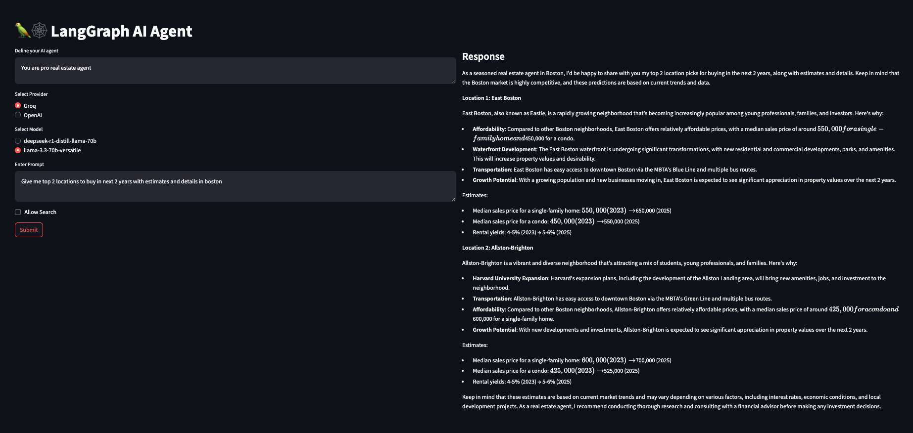
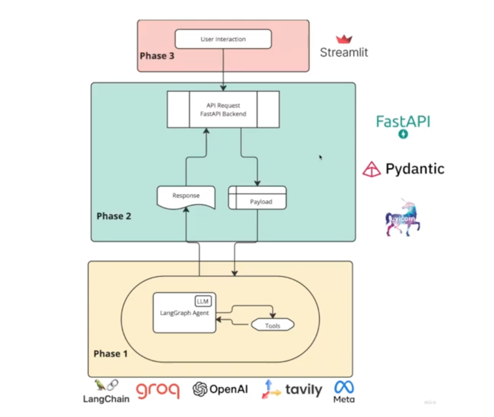
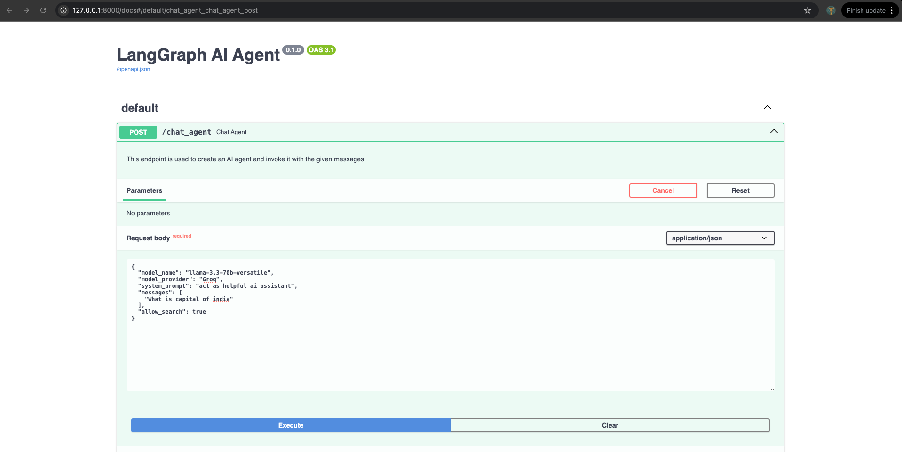
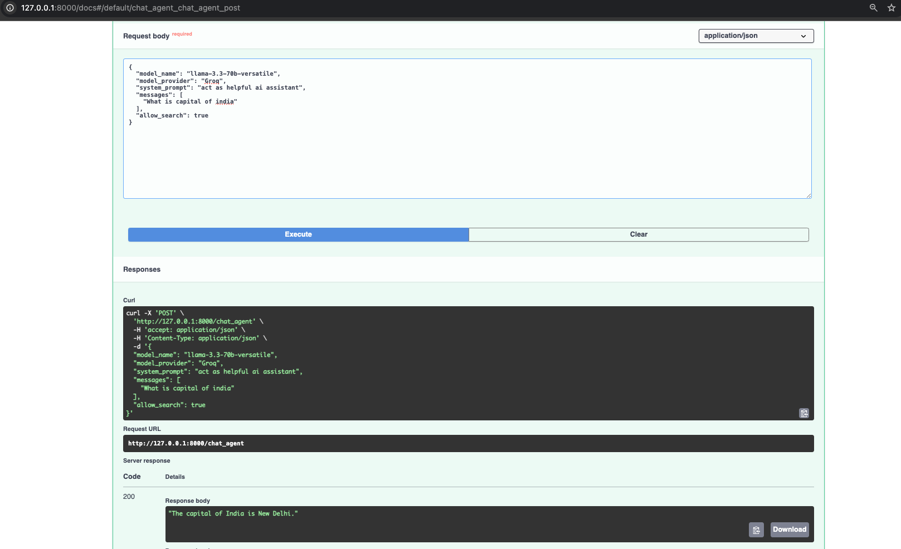

# ASKAgent

## Overview

ASKAgent is a agent built using FastAPI. This project aims to provide a robust and scalable solution that can be easily integrated into various applications. The agent leverages natural language processing (NLP) techniques to understand and respond to user queries effectively.



## Architecture



## Project Layout

### Phase 1 - Create AI Agent

1. **Setup API Keys for Groq and Tavily**: 
   - **Groq API Key**: Used to authenticate and access the Groq services for natural language processing tasks.
   - **Tavily API Key**: Used to authenticate and access the Tavily services for search functionalities.

2. **Setup LLM & Tools**: 
   - **Groq**: A large language model used for processing and generating natural language responses.
   - **OpenAI**: Another large language model option for handling natural language tasks.
   - **TavilySearchResults**: A tool integrated to enhance the agent's capabilities with search functionalities, allowing it to fetch relevant information from the web.

3. **Setup AI Agent with Search Tool Functionality**: 
   - **create_react_agent**: A function used to configure the AI agent with the selected LLM and tools, enabling it to process user queries and provide relevant responses.

### Phase 2 - Setup Backend (With FastAPI)

1. **Setup Pydantic Model (Schema Validation)**: 
   - **Pydantic**: A data validation and serialization library used to ensure that the data received from the frontend is correctly formatted and adheres to the expected schema.

2. **Setup AI Agent from Frontend Request**: 
   - **FastAPI**: A web framework used to handle requests from the frontend, invoking the AI agent to process queries and return responses.

3. **Run App & Explore Swagger UI Docs**: 
   - **Swagger UI**: An interactive documentation interface provided by FastAPI, used to explore and test the API endpoints.

### Phase 3 - Setup Frontend

1. **Setup UI with Streamlit (Model Provider, Model, System Prompt, Query)**: 
   - **Streamlit**: A framework used to create a user-friendly interface where users can select the model provider, specify the model, set system prompts, and enter their queries.

2. **Connect with Backend via API**: 
   - **API Calls**: Used to connect the frontend to the backend, allowing the frontend to send user queries to the backend, where the AI agent processes them and returns the responses to be displayed on the UI.


## Use Cases

1. **Customer Support**: Automate responses to common customer queries, reducing the workload on human agents.
2. **Virtual Assistant**: Assist users with tasks such as scheduling, reminders, and information retrieval.
3. **E-commerce**: Provide product recommendations, order tracking, and customer service.
4. **Education**: Offer tutoring and answer questions related to specific subjects.

## Setup Instructions

### Prerequisites

- Python 3.8 or higher
- Account on Groq, Open AI, Tavily AI
- Virtual environment tool (optional but recommended)

### Environment Setup

1. **Clone the repository**:
    ```bash
    git clone https://github.com/iaamar/langgraph-ai-agent-fastapi.git
    cd langgraph-ai-agent-fastapi
    ```

2. **Create a virtual environment** (optional but recommended):
    ```bash
    python -m venv venv
    source venv/bin/activate
    ```

3. **Environment Variables**:
    Create a `.env` file in the root directory and add the necessary environment variables. Example:
    ```env
    GROQ_API_KEY=your_api_key_here
    OPENAI_API_KEY=your_api_key_here
    TAVILY_API_KEY=your_api_key_here
    ```

4. **Install the required dependencies**:
    ```bash
    pip install -r requirements.txt
    ```
5. **cd into root repository**:
    ```bash
    cd langgraph-ai-agent-fastapi
    ```
6. **Run backend**
    ```bash
    python3 backend.py
    ```
7. **Run Frontend**
    ```bash
    python3 frontend.py
    ```

## Running the Application

1. **Start the FastAPI server**:
    ```bash
    http://127.0.0.1:8000/docs
    ```

2. **Access the API documentation**:
    Open your browser and navigate to `http://127.0.0.1:8000/docs` to view the interactive API documentation provided by Swagger UI.

    

## API Instructions

### Endpoints

- **POST /chat_agent**: Send a new message to the LLM.
    - Request Body:
        

### Example Usage

1. **Send a message to the LLM**:
    ```bash
    curl -X POST 'http://127.0.0.1:8000/chat_agent' -H 'accept: application/json' -H 'Content-Type: application/json' -d '{"model_name": "llama-3.3-70b-versatile", "model_provider", "Groq", "system_prompt": "act as helpful ai assistant", "messages": [ "What is capital of india"], "allow_search": true}'
    ```

## Contributing

Contributions are welcome! Please fork the repository and create a pull request with your changes.

## License

This project is licensed under the MIT License. See the [LICENSE](LICENSE) file for details.

## Contact

For any questions or inquiries, please contact [your email here].
